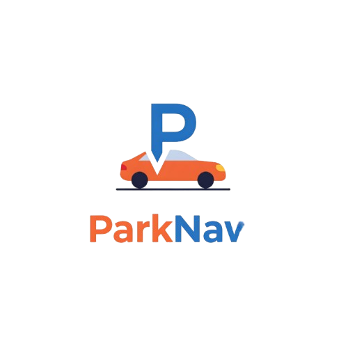

<div align="center">
  
  #  ParkNav
  
  **Park Smarter, Not Harder**
  
  A modern parking solution that helps drivers find, book, and navigate to available parking spots in real-time across major cities in India.
  
  [](https://react.dev/)
  [](https://www.typescriptlang.org/)
  [](https://vitejs.dev/)
  [](LICENSE)
  
</div>

---

## What is ParkNav?

ParkNav is an intelligent parking management platform designed to eliminate the frustration of finding parking in busy urban areas. With real-time availability tracking, smart routing, and instant booking capabilities, we're transforming how people park in cities.

### The Problem We Solve

- **Time Wasted**: Average drivers spend 15+ minutes circling for parking
- **Uncertainty**: No visibility into parking availability before arrival
- **Inefficiency**: Manual payment systems and lack of digital integration
- **Stress**: Last-minute parking searches during important meetings or events

### Our Solution

ParkNav provides a comprehensive digital parking ecosystem with live updates, AI-powered recommendations, and seamless booking—all in one app.

---

## Key Features

### 🗺️ **Interactive Map View**
Real-time parking spot visualization with color-coded availability status. Navigate directly to your chosen spot with turn-by-turn directions powered by Leaflet maps.

### 🔍 **Smart Search**
AI-powered search that understands your destination and recommends the best parking options based on distance, price, availability, and user ratings.

### ⚡ **Live Availability**
Parking status updates every 30 seconds. See exactly how many spots are available before you even leave home.

### 💳 **Instant Booking**
Reserve your spot in seconds with integrated payment options (UPI, cards, wallets). Get a QR code for contactless entry.

### 📊 **Smart Analytics**
View parking demand heatmaps, historical trends, and predictive availability to plan your trips better.

### 🔐 **Verified & Secure**
All parking locations are verified with CCTV coverage, security details, and user reviews for your peace of mind.

### 🚗 **EV Charging Finder**
Locate parking spots with electric vehicle charging stations. Filter by charging speed and connector type.

### ⭐ **User Reviews & Ratings**
Community-driven ratings help you choose the best parking spots based on real experiences.

---

## Tech Stack

### Frontend
- **React 19** - Modern UI library with concurrent features
- **TypeScript** - Type-safe development
- **Vite** - Lightning-fast build tool and dev server
- **React Router** - Client-side routing
- **Framer Motion** - Smooth animations and transitions

### UI Components
- **Radix UI** - Accessible, unstyled component primitives
- **Tailwind CSS 4** - Utility-first styling
- **Lucide React** - Beautiful icon library
- **shadcn/ui** - Re-usable component patterns

### Maps & Visualization
- **Leaflet** - Interactive map rendering
- **React Leaflet** - React bindings for Leaflet
- **Cobe** - 3D globe visualization
- **Recharts** - Data visualization charts

### State & Forms
- **React Hook Form** - Performant form handling
- **Sonner** - Toast notifications

---

## Getting Started

### Prerequisites

- Node.js 18+ or Bun
- npm, yarn, or bun package manager

### Installation

1. Clone the repository
```bash
git clone https://github.com/yourusername/parknav.git
cd parknav
```

2. Install dependencies
```bash
npm install
# or
yarn install
# or
bun install
```

3. Start the development server
```bash
npm run dev
# or
yarn dev
# or
bun dev
```

4. Open your browser and navigate to `http://localhost:5173`

### Build for Production

```bash
npm run build
npm run preview
```

The optimized production build will be in the `dist` folder.

---

## Project Structure

```
parknav/
├── public/              # Static assets
│   ├── logo.png
│   └── robots.txt
├── src/
│   ├── assets/          # Images and media
│   ├── components/      # Reusable UI components
│   │   ├── Map/         # Map-related components
│   │   ├── Navigation/  # Navigation bars
│   │   ├── ParkingSpots/# Parking spot cards & lists
│   │   └── ui/          # shadcn/ui components
│   ├── data/            # Mock data and constants
│   ├── hooks/           # Custom React hooks
│   ├── lib/             # Utility functions
│   ├── pages/           # Route pages
│   │   ├── Dashboard.tsx
│   │   ├── Home.tsx
│   │   ├── MapPage.tsx
│   │   └── ...
│   ├── types/           # TypeScript type definitions
│   ├── App.tsx          # Root component
│   ├── main.tsx         # Entry point
│   └── index.css        # Global styles
├── index.html
├── package.json
├── tsconfig.json
├── vite.config.ts
└── README.md
```

---

## Performance Optimizations

ParkNav is built with performance in mind:

- **Code Splitting**: Lazy-loaded routes reduce initial bundle size by 60%
- **Optimized Animations**: Canvas rendering capped at 30fps for smooth performance
- **Smart Chunking**: Vendor libraries split for better caching
- **Image Optimization**: Preconnect hints and DNS prefetch for external resources
- **Tree Shaking**: Unused code automatically removed during build

**Bundle Size**: ~185KB (gzipped: ~59KB) for main bundle

---

## Available Scripts

| Command | Description |
|---------|-------------|
| `npm run dev` | Start development server |
| `npm run build` | Build for production |
| `npm run preview` | Preview production build |
| `npm run lint` | Run ESLint |

---

## Features Roadmap

- [ ] Real-time parking availability API integration
- [ ] User authentication and profiles
- [ ] Payment gateway integration (Razorpay/Stripe)
- [ ] Push notifications for booking reminders
- [ ] Multi-language support
- [ ] Dark/Light theme toggle
- [ ] Parking history and analytics dashboard
- [ ] Social features (share spots, reviews)
- [ ] Mobile app (React Native)
- [ ] Admin dashboard for parking lot owners

---

## Contributing

We welcome contributions! Here's how you can help:

1. Fork the repository
2. Create a feature branch (`git checkout -b feature/amazing-feature`)
3. Commit your changes (`git commit -m 'Add some amazing feature'`)
4. Push to the branch (`git push origin feature/amazing-feature`)
5. Open a Pull Request

Please read our [Contributing Guidelines](CONTRIBUTING.md) for more details.

---

## License

This project is licensed under the MIT License - see the [LICENSE](LICENSE) file for details.

---

## Acknowledgments

- Design inspiration from modern parking apps
- Map data powered by OpenStreetMap
- Icons by Lucide
- UI components from shadcn/ui
- Community feedback and testing

---

## Contact & Support

- **Website**: [parknav.app](https://parknav.app)
- **Email**: support@parknav.app
- **Twitter**: [@ParkNavApp](https://twitter.com/parknavapp)
- **Discord**: [Join our community](https://discord.gg/parknav)

---

<div align="center">
  
  **Made with ❤️ for drivers who value their time**
  
  If you find ParkNav useful, please consider giving it a ⭐ on GitHub!
  
</div>
